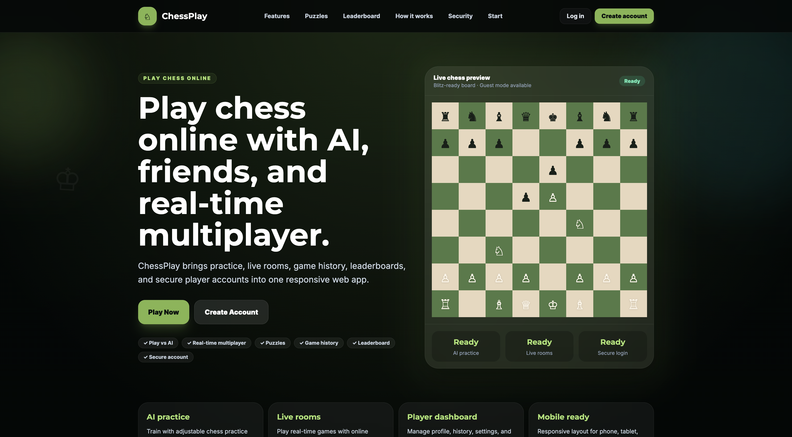
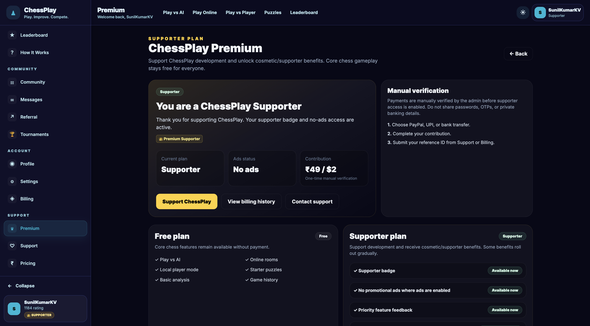

# ChessPlay

Production-ready real-time chess platform showcase.

ChessPlay is a full-stack chess product focused on real-time multiplayer gameplay, AI-powered practice, authenticated dashboards, leaderboards, social features, and production deployment.


## Live Demo

- Live app: https://getchessplay.vercel.app/
- Developer portfolio: https://sunilcraft.vercel.app

## Product Overview

ChessPlay is designed as a modern chess platform where users can play online, challenge AI, track progress, manage profiles, and experience a polished game dashboard.

This public repository is used as a professional showcase for the product. Sensitive production code, secrets, infrastructure configuration, and private backend implementation details are not exposed here.

## Key Features

### Gameplay

- Real-time multiplayer chess
- Play vs AI using Stockfish
- Legal move validation
- Game timers
- Game history
- Leaderboard
- Resign and game-end flows

### User Platform

- Authentication
- User dashboard
- Profile management
- Friends system
- Notifications
- Referral rewards
- Premium membership planning

### Product & Engineering

- Responsive web UI
- Socket-based real-time communication
- Production deployment workflow
- Scalable architecture planning
- PostgreSQL/Prisma migration planning
- Mobile app roadmap

## Tech Stack

### Frontend

- React.js
- Vite
- Tailwind CSS
- JavaScript / TypeScript migration path

### Backend

- Node.js
- Express.js
- Socket.IO

### Database

- MongoDB
- PostgreSQL migration roadmap
- Prisma planning

### Deployment

- Vercel
- Render / Railway planning
- GitHub release workflow

## Screenshots






## Architecture Overview

```txt
React Frontend
   ↓
REST API + Socket.IO
   ↓
Node.js + Express Backend
   ↓
Database Layer
   ↓
MongoDB / PostgreSQL Migration Path
```

## Repository Purpose

This repository is intentionally public and focuses on:

- product presentation
- screenshots
- feature documentation
- roadmap documentation
- recruiter/client showcase
- launch and marketing visibility

Private production implementation details remain protected in the private production repository.

## Roadmap

- [ ] Tournament mode
- [ ] Enhanced AI difficulty levels
- [ ] Puzzle/training mode
- [ ] Mobile app release
- [ ] Advanced player analytics
- [ ] Premium subscriptions
- [ ] Better social gameplay features
- [ ] PostgreSQL + Prisma production migration

## Developer

Sunil Kumar K V

- Portfolio: https://sunilcraft.vercel.app
- LinkedIn: https://www.linkedin.com/in/sunilkumarkv44/
- GitHub: https://github.com/SunilKumarKV

## License

MIT
