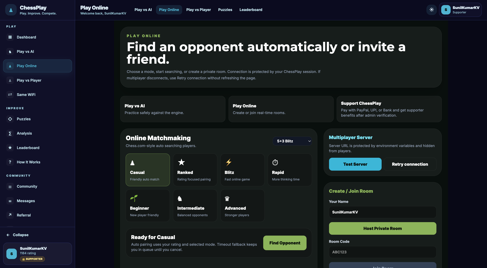

# ♟️ ChessPlay

## Production-Ready Real-Time Chess Platform

ChessPlay is a modern full-stack chess platform focused on real-time gameplay, AI challenges, premium features, and a polished user experience.


---

## 🚀 Live Demo

🔗 https://chessplay1.vercel.app

---

## ✨ Features

### Core Gameplay
- Real-time multiplayer chess
- Play vs AI (Stockfish)
- Move validation
- Game timers
- Leaderboard
- Game history
- Friends & notifications

### User Experience
- Responsive UI
- Modern dashboard
- Premium memberships
- Referral rewards
- Profile customization
- Smooth animations

### Product Features
- Authentication
- Real-time Socket.IO communication
- Production deployment
- Scalable architecture
- Mobile-friendly UI

---

## 🛠 Tech Stack

### Frontend
- React.js
- Vite
- Tailwind CSS
- JavaScript / TypeScript migration

### Backend
- Node.js
- Express.js
- Socket.IO

### Database
- MongoDB
- PostgreSQL (migration in progress)
- Prisma

### Deployment
- Vercel
- Render
- GitHub Actions

---

## 📸 Screenshots

Add screenshots:

```txt
/screenshots
```

Examples:

```txt
home.png
dashboard.png
multiplayer.png
premium.png
profile.png
```

Then show:

```md


```

---

## 🏗 Architecture Overview

```txt
Frontend (React)
   ↓
REST API + Socket.IO
   ↓
Node.js + Express
   ↓
MongoDB / PostgreSQL
```

---

## 🔒 Security

This public repository contains showcase/documentation only.

Private production backend logic, secrets, payment infrastructure, and sensitive implementation details are not exposed.

---

## 🚀 Roadmap

- [ ] Tournament mode
- [ ] Enhanced AI difficulty modes
- [ ] Mobile app
- [ ] Advanced analytics
- [ ] Social gameplay features

---

## 👨‍💻 Developer

Sunil Kumar K V

LinkedIn:
https://www.linkedin.com/in/sunilkumarkv44/

Portfolio:
https://sunilcraft.vercel.app

---

## License

MIT
